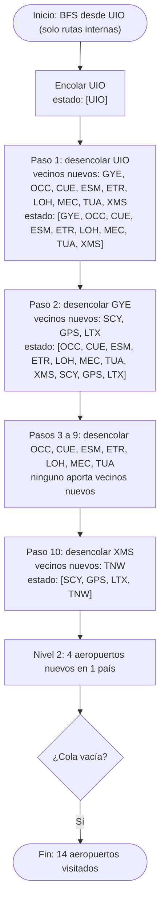

# Flujograma dinámico: BFS desde UIO (detalle hasta nivel 1)

Generado por IA desde el registro de eventos

```mermaid
flowchart TD
    A(["Inicio: BFS desde UIO (solo rutas internas)"]) --> B["Encolar UIO<br/>estado: [UIO]"]
    B --> C["Paso 1: desencolar UIO<br/>vecinos nuevos: GYE, OCC, CUE, ESM, ETR, LOH, MEC, TUA, XMS<br/>estado: [GYE, OCC, CUE, ESM, ETR, LOH, MEC, TUA, XMS]"]
    C --> D["Paso 2: desencolar GYE<br/>vecinos nuevos: SCY, GPS, LTX<br/>estado: [OCC, CUE, ESM, ETR, LOH, MEC, TUA, XMS, SCY, GPS, LTX]"]
    D --> E["Pasos 3 a 9: desencolar OCC, CUE, ESM, ETR, LOH, MEC, TUA<br/>ninguno aporta vecinos nuevos"]
    E --> F["Paso 10: desencolar XMS<br/>vecinos nuevos: TNW<br/>estado: [SCY, GPS, LTX, TNW]"]
    F --> G["Nivel 2: 4 aeropuertos nuevos en 1 país"]
    G --> H{"¿Cola vacía?"}
    H -->|"Sí"| I(["Fin: 14 aeropuertos visitados"])
```

Para verlo con zoom abrir `ver_flujo_bfs.html`.
