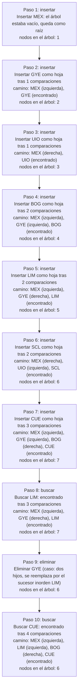

# Flujograma: BST por IATA (insertar, buscar y eliminar)

Generado por IA desde el registro de eventos

```mermaid
flowchart TD
    P1["Paso 1: insertar<br/>Insertar MEX: el árbol estaba vacío, queda como raíz<br/>nodos en el árbol: 1"]
    P2["Paso 2: insertar<br/>Insertar GYE como hoja tras 1 comparaciones<br/>camino: MEX (izquierda), GYE (encontrado)<br/>nodos en el árbol: 2"]
    P3["Paso 3: insertar<br/>Insertar UIO como hoja tras 1 comparaciones<br/>camino: MEX (derecha), UIO (encontrado)<br/>nodos en el árbol: 3"]
    P4["Paso 4: insertar<br/>Insertar BOG como hoja tras 2 comparaciones<br/>camino: MEX (izquierda), GYE (izquierda), BOG (encontrado)<br/>nodos en el árbol: 4"]
    P5["Paso 5: insertar<br/>Insertar LIM como hoja tras 2 comparaciones<br/>camino: MEX (izquierda), GYE (derecha), LIM (encontrado)<br/>nodos en el árbol: 5"]
    P6["Paso 6: insertar<br/>Insertar SCL como hoja tras 2 comparaciones<br/>camino: MEX (derecha), UIO (izquierda), SCL (encontrado)<br/>nodos en el árbol: 6"]
    P7["Paso 7: insertar<br/>Insertar CUE como hoja tras 3 comparaciones<br/>camino: MEX (izquierda), GYE (izquierda), BOG (derecha), CUE (encontrado)<br/>nodos en el árbol: 7"]
    P8["Paso 8: buscar<br/>Buscar LIM: encontrado tras 3 comparaciones<br/>camino: MEX (izquierda), GYE (derecha), LIM (encontrado)<br/>nodos en el árbol: 7"]
    P9["Paso 9: eliminar<br/>Eliminar GYE (caso: dos hijos, se reemplaza por el sucesor inorden LIM)<br/>nodos en el árbol: 6"]
    P10["Paso 10: buscar<br/>Buscar CUE: encontrado tras 4 comparaciones<br/>camino: MEX (izquierda), LIM (izquierda), BOG (derecha), CUE (encontrado)<br/>nodos en el árbol: 6"]
    P1 --> P2
    P2 --> P3
    P3 --> P4
    P4 --> P5
    P5 --> P6
    P6 --> P7
    P7 --> P8
    P8 --> P9
    P9 --> P10
```

Para verlo con zoom abrir `ver_flujo_bst.html`.
