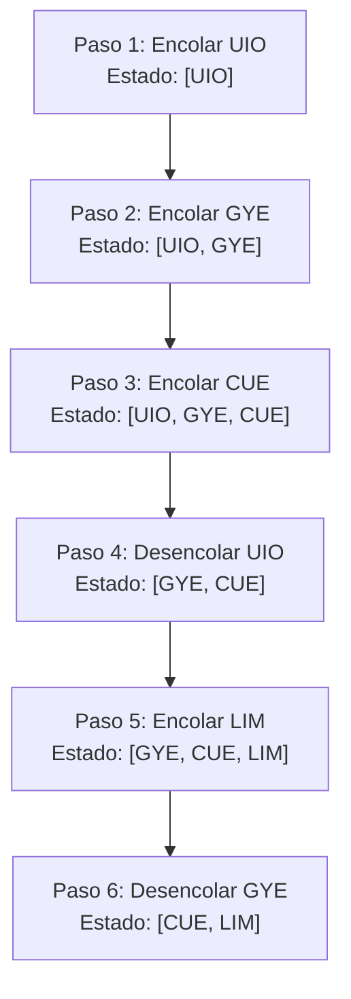

# Flujograma: Cola (encolar y desencolar aeropuertos)

Generado por IA desde el registro de eventos

```mermaid
flowchart TD
    A["Paso 1: Encolar UIO<br/>Estado: [UIO]"] --> B["Paso 2: Encolar GYE<br/>Estado: [UIO, GYE]"]
    B --> C["Paso 3: Encolar CUE<br/>Estado: [UIO, GYE, CUE]"]
    C --> D["Paso 4: Desencolar UIO<br/>Estado: [GYE, CUE]"]
    D --> E["Paso 5: Encolar LIM<br/>Estado: [GYE, CUE, LIM]"]
    E --> F["Paso 6: Desencolar GYE<br/>Estado: [CUE, LIM]"]
```

Para verlo con zoom abrir `ver_flujo_cola.html`.
