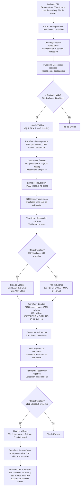

# Flujograma del ETL (eventos reales)

Generado por IA desde el registro de eventos

```mermaid
flowchart TD
    A["Inicio del ETL<br/>Extract a Cola, Transform a Lista de válidos y Pila de errores"] --> B["Extract lee airports.csv<br/>7698 líneas, 0 no leídas"]
    B --> C["7698 registros de aeropuertos<br/>encolados en la cola de extracción"]
    C --> D["Transform: Desencolar registros<br/>Validación de aeropuertos"]
    D --> E{"¿Registro válido?<br/>7698 válidos, 0 inválidos"}
    E -- "Sí" --> F["Lista de Válidos<br/>(Ej: 1 GKA, 2 MAG, 3 HGU)"]
    E -- "No" --> G["Pila de Errores"]
    F --> H["Transform de aeropuertos:<br/>7698 procesados, 7698 válidos, 0 inválidos"]
    H --> I["Creación de Índices:<br/>BST global por IATA (6071 nodos)<br/>y lista ordenada por ID"]
    I --> J["Extract lee routes.csv<br/>67663 líneas, 0 no leídas"]
    J --> K["67663 registros de rutas<br/>encolados en la cola de extracción"]
    K --> L["Transform: Desencolar registros<br/>Validación de rutas"]
    L --> M{"¿Registro válido?<br/>67074 válidos, 589 inválidos"}
    M -- "Sí" --> N["Lista de Válidos<br/>(Ej: 2B AER-KZN, ASF-KZN, ASF-MRV)"]
    M -- "No" --> O["Pila de Errores<br/>(Ej: REFERENCIA_ROTA, ID_NULO)"]
    N --> P["Transform de rutas:<br/>67663 procesados, 67074 válidos,<br/>589 inválidos (REFERENCIA_ROTA 473, ID_NULO 116)"]
    O --> P
    P --> Q["Extract lee airlines.csv<br/>6162 líneas, 0 no leídas"]
    Q --> R["6162 registros de aerolíneas<br/>encolados en la cola de extracción"]
    R --> S["Transform: Desencolar registros<br/>Validación de aerolíneas"]
    S --> T{"¿Registro válido?<br/>6162 válidos, 0 inválidos"}
    T -- "Sí" --> U["Lista de Válidos<br/>(Ej: -1 Unknown, 1 Private, 2 135 Airways)"]
    T -- "No" --> V["Pila de Errores"]
    U --> W["Transform de aerolíneas:<br/>6162 procesados, 6162 válidos, 0 inválidos"]
    W --> X["Load / Fin del Transform:<br/>80934 válidos en listas y 589 errores en la pila<br/>Escritura de archivos limpios"]
```

Para verlo con zoom abrir `ver_flujo_etl.html`.
