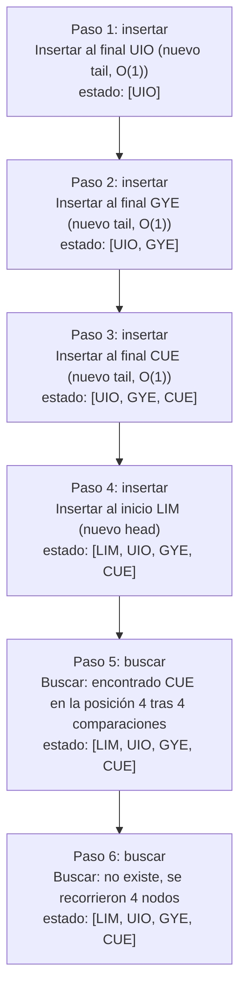

# Flujograma: Lista enlazada (insertar y buscar)

Generado por IA desde el registro de eventos

```mermaid
flowchart TD
    A["Paso 1: insertar<br/>Insertar al final UIO (nuevo tail, O(1))<br/>estado: [UIO]"]
    B["Paso 2: insertar<br/>Insertar al final GYE (nuevo tail, O(1))<br/>estado: [UIO, GYE]"]
    C["Paso 3: insertar<br/>Insertar al final CUE (nuevo tail, O(1))<br/>estado: [UIO, GYE, CUE]"]
    D["Paso 4: insertar<br/>Insertar al inicio LIM (nuevo head)<br/>estado: [LIM, UIO, GYE, CUE]"]
    E["Paso 5: buscar<br/>Buscar: encontrado CUE en la posición 4 tras 4 comparaciones<br/>estado: [LIM, UIO, GYE, CUE]"]
    F["Paso 6: buscar<br/>Buscar: no existe, se recorrieron 4 nodos<br/>estado: [LIM, UIO, GYE, CUE]"]
    A --> B
    B --> C
    C --> D
    D --> E
    E --> F
```

Para verlo con zoom abrir `ver_flujo_lista.html`.
