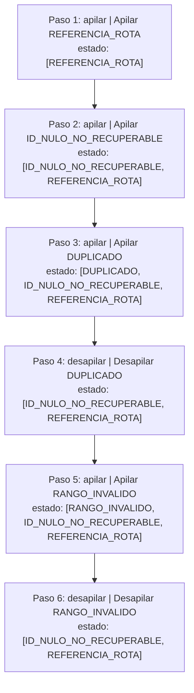

# Flujograma: Pila (apilar y desapilar errores del ETL)

Generado por IA desde el registro de eventos

```mermaid
flowchart TD
    P1["Paso 1: apilar | Apilar REFERENCIA_ROTA<br/>estado: [REFERENCIA_ROTA]"]
    P2["Paso 2: apilar | Apilar ID_NULO_NO_RECUPERABLE<br/>estado: [ID_NULO_NO_RECUPERABLE, REFERENCIA_ROTA]"]
    P3["Paso 3: apilar | Apilar DUPLICADO<br/>estado: [DUPLICADO, ID_NULO_NO_RECUPERABLE, REFERENCIA_ROTA]"]
    P4["Paso 4: desapilar | Desapilar DUPLICADO<br/>estado: [ID_NULO_NO_RECUPERABLE, REFERENCIA_ROTA]"]
    P5["Paso 5: apilar | Apilar RANGO_INVALIDO<br/>estado: [RANGO_INVALIDO, ID_NULO_NO_RECUPERABLE, REFERENCIA_ROTA]"]
    P6["Paso 6: desapilar | Desapilar RANGO_INVALIDO<br/>estado: [ID_NULO_NO_RECUPERABLE, REFERENCIA_ROTA]"]
    P1 --> P2 --> P3 --> P4 --> P5 --> P6
```

Para verlo con zoom abrir `ver_flujo_pila.html`.
